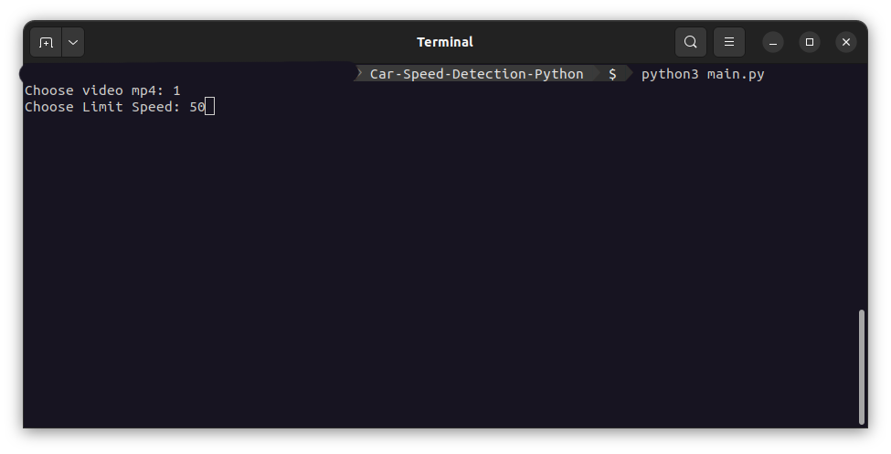
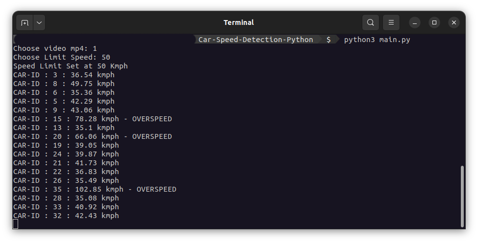
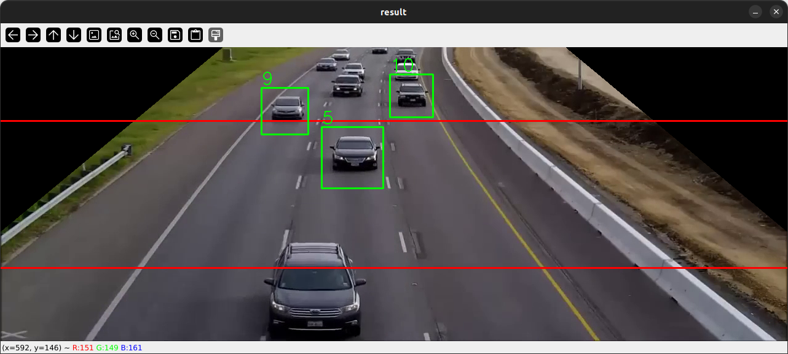
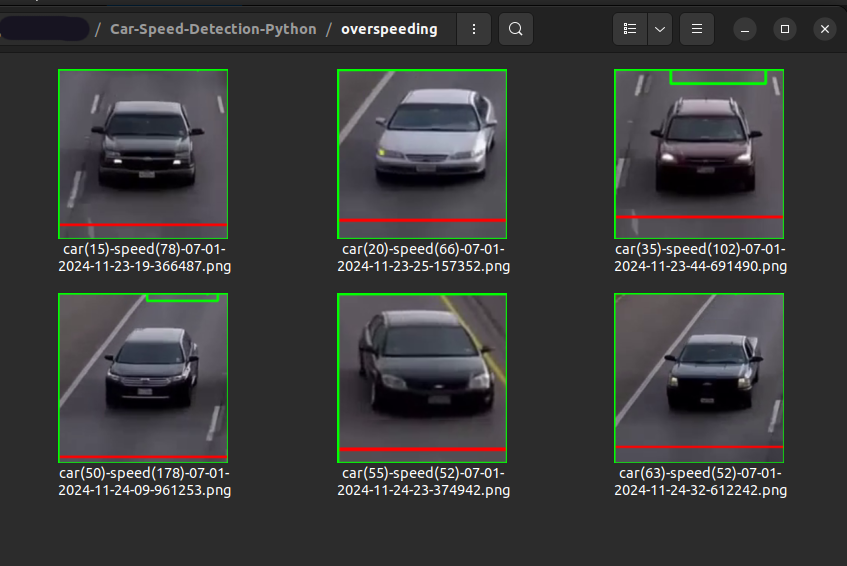

# Speed-Detection-Cars

## Description
This project is a vehicle speed detection system using a camera, capable of detecting and saving an image of the violating vehicle

## Screenshots

## Installation
1. Clone the repository
2. Insatll `Python3` and `pip3`
3. Install `OpenCV` , `Numpy` and `dlib`
4. Run the `main.py` file

## Usage
1. Run the `main.py` file
2. Enter the path of the video
3. Enter Speed Limit

## License
[MIT](./LICENSE)

